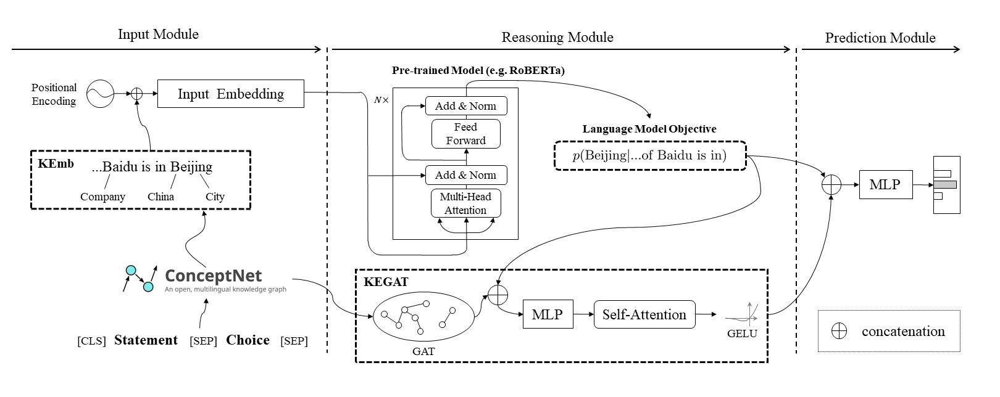
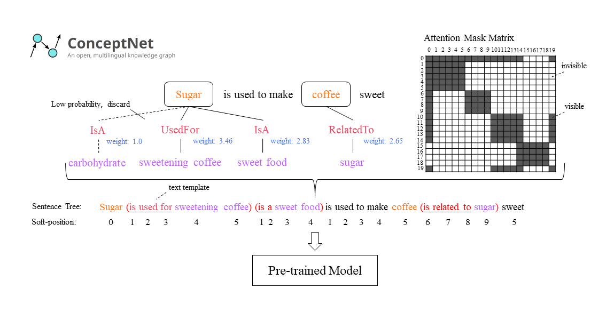

# ECNU-SenseMaker (SemEval-2020 Task 4)

[](https://raw.githubusercontent.com/im0qianqian/CodeforcesEduHacking/master/LICENSE)

Source code for "[ECNU-SenseMaker at SemEval-2020 Task 4: Leveraging Heterogeneous Knowledge Resources for Commonsense Validation and Explanation](https://www.aclweb.org/anthology/2020.semeval-1.48.pdf)" (SemEval 2020).


## Introduction

- The overview of ECNU-SenseMaker.

  

- The KEmb module.

  


## Leaderboard

### Subtask B (Top-5)

| User            | Team Name    | Accuracy | Rank  |
| --------------- | ------------ | -------- | ----- |
| **im0qianqian** | **ECNU_ICA** | **95.0** | **1** |
| jession         | hit_itnlp    | 94.8     | 2     |
| Solomon         | Solomon      | 94.0     | 3     |
| w-h-m           | NEUKG        | 93.8     | 3     |
| xlx             | NUT          | 93.7     | 5     |

### Subtask A (Top-5)

| User            | Team Name    | Accuracy | Rank  |
| --------------- | ------------ | -------- | ----- |
| jession         | hit_itnlp    | 97.0     | 1     |
| **im0qianqian** | **ECNU_ICA** | **96.7** | **2** |
| xlx             | NUT          | 96.4     | 3     |
| nlpx            |              | 96.4     | 3     |
| Solomon         | Solomon      | 96.0     | 5     |


## Usage

### 1. Envs and Dependencies

```bash
# create a conda envs
conda create -n semeval2020 python=3.6 ipython
conda activate semeval2020

# pytorch
conda install pytorch=1.6 cudatoolkit=10.2 -c pytorch

# transformers
pip install transformers==2.5.1

# pyG
CUDA=cu102
TORCH=1.6.0
pip install torch-scatter -f https://pytorch-geometric.com/whl/torch-${TORCH}+${CUDA}.html
pip install torch-sparse -f https://pytorch-geometric.com/whl/torch-${TORCH}+${CUDA}.html
pip install torch-cluster -f https://pytorch-geometric.com/whl/torch-${TORCH}+${CUDA}.html
pip install torch-spline-conv -f https://pytorch-geometric.com/whl/torch-${TORCH}+${CUDA}.html
pip install torch-geometric

# sklearn
conda install scikit-learn=0.21.3

# bidict
pip install bidict==0.18.3

# nltk
conda install nltk

# tensorboard
conda install TensorBoard==1.15

# others
pip install future
pip install wordfreq
```


### 2. Download Data

- Download the `conceptnet5.zip` from [here](https://stuecnueducn-my.sharepoint.com/:u:/g/personal/51194506093_stu_ecnu_edu_cn/EV9Hj5WtCnBKuLJsVxgtPBkB7MgfcEBbdkDKASp6mtA1cA?e=RdTn7A), and unzip it to the `conceptnet5/` directory.
- Download the `pre_weights.zip` from [here](https://stuecnueducn-my.sharepoint.com/:u:/g/personal/51194506093_stu_ecnu_edu_cn/ERo8KABupFBBnQhW8mKIX78BtNt5Gw42T6WXV2bhtgBONw?e=eqnEgf), and unzip it to the `pre_weights/` directory.

The directory tree of ECNU-SenseMaker:

```
ECNU-SenseMaker
├── commonsenseQA
│   ├── dev_rand_split_EASY.jsonl
│   ├── dev_rand_split.jsonl
│   ├── test_rand_split_no_answers.jsonl
│   ├── train_rand_split_EASY.jsonl
│   └── train_rand_split.jsonl
├── conceptnet5
│   ├── numberbatch-en.txt
│   └── res_all.pickle
├── config.py
├── functions.py
├── loss.py
├── model_modify.py
├── models.py
├── optimizer.py
├── pre_weights
│   ├── albert-xxlarge_model.bin
│   ├── bert-base-uncased_model.bin
│   ├── roberta-base_model.bin
│   └── roberta-large_model.bin
├── README.md
├── run_ensemble_model.py
├── run_single_model.py
├── SemEval2020-Task4-Commonsense-Validation-and-Explanation-master
│   ├── Training Data
│   │   ├── subtaskA_answers_all.csv
│   │   ├── subtaskA_data_all.csv
│   │   ├── subtaskB_answers_all.csv
│   │   ├── subtaskB_data_all.csv
│   │   ├── subtaskC_answers_all.csv
│   │   └── subtaskC_data_all.csv
│   ...
|
└── utils
    ├── attentionUtils.py
    ├── commonsenseQAutils.py
    ├── ensembleUtils.py
    ├── getGraphUtils.py
    ├── gpu_mem_track.py
    ├── GraphUtils.py
    ├── __init__.py
    ├── MyDataset.py
    ├── semevalUtils.py
    ├── testUtils.py
    └── text_to_uri.py
```


### 3. Training and Evaluation

Run example on **Subtask B** with **LM** and **KEGAT**:

```
CUDA_VISIBLE_DEVICES='0' python -u -m run_single_model \
	--batch-size 8 \
	--test-batch-size 8 \
	--epochs 4 \
	--fine-tune-epochs 8 \
	--lr 0.001 \
	--fine-tune-lr 0.000005 \
	--adam-epsilon 0.000001 \
	--max-seq-length 128 \
	--subtask-id B \
	--with-lm \
	--with-kegat
```

Options of `run_single_model.py`:

```
usage: run_single_model.py [-h] [--batch-size N] [--test-batch-size N]
                           [--epochs N] [--fine-tune-epochs N] [--lr LR]
                           [--fine-tune-lr LR] [--adam-epsilon M]
                           [--max-seq-length N] [--subtask-id {A,B}]
                           [--with-lm] [--with-kegat] [--with-kemb]
                           [--no-cuda] [--seed S]

ECNU-SenseMaker single model

optional arguments:
  -h, --help            show this help message and exit
  --batch-size N        input batch size for training (default: 8)
  --test-batch-size N   input batch size for testing (default: 8)
  --epochs N            number of epochs to train (default: 4)
  --fine-tune-epochs N  number of fine-tune epochs to train (default: 8)
  --lr LR               learning rate (default: 0.001)
  --fine-tune-lr LR     fine-tune learning rate (default: 5e-06)
  --adam-epsilon M      Adam epsilon (default: 1e-06)
  --max-seq-length N    max length of sentences (default: 128)
  --subtask-id {A,B}    subtask A or B (default: B)
  --with-lm             Add Internal Sharing Mechanism (LM)
  --with-kegat          Add Knowledge-enhanced Graph Attention Network (KEGAT)
  --with-kemb           Add Knowledge-enhanced Embedding (KEmb)
  --no-cuda             disables CUDA training
  --seed S              random seed (default: 1)
```


## References

Please cite this repository using the following reference:

```bib
@inproceedings{zhao-etal-2020-ecnu,
    title = "{ECNU}-{S}ense{M}aker at {S}em{E}val-2020 Task 4: Leveraging Heterogeneous Knowledge Resources for Commonsense Validation and Explanation",
    author = "Zhao, Qian  and
      Tao, Siyu  and
      Zhou, Jie  and
      Wang, Linlin  and
      Lin, Xin  and
      He, Liang",
    booktitle = "Proceedings of the Fourteenth Workshop on Semantic Evaluation",
    month = dec,
    year = "2020",
    address = "Barcelona (online)",
    publisher = "International Committee for Computational Linguistics",
    url = "https://www.aclweb.org/anthology/2020.semeval-1.48",
    pages = "401--410",
    abstract = "This paper describes our system for SemEval-2020 Task 4: Commonsense Validation and Explanation (Wang et al., 2020). We propose a novel Knowledge-enhanced Graph Attention Network (KEGAT) architecture for this task, leveraging heterogeneous knowledge from both the structured knowledge base (i.e. ConceptNet) and unstructured text to better improve the ability of a machine in commonsense understanding. This model has a powerful commonsense inference capability via utilizing suitable commonsense incorporation methods and upgraded data augmentation techniques. Besides, an internal sharing mechanism is cooperated to prohibit our model from insufficient and excessive reasoning for commonsense. As a result, this model performs quite well in both validation and explanation. For instance, it achieves state-of-the-art accuracy in the subtask called Commonsense Explanation (Multi-Choice). We officially name the system as ECNU-SenseMaker. Code is publicly available at https://github.com/ECNU-ICA/ECNU-SenseMaker.",
}
```

